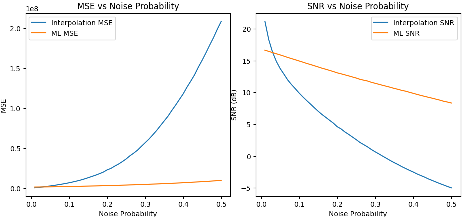
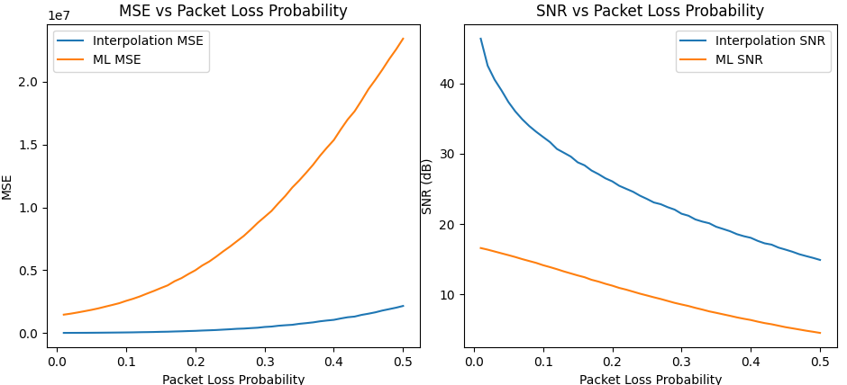

# So sánh Nội suy và Học máy trong Khôi phục Âm thanh

Đây là dự án môn **Phương pháp tính**, tập trung vào việc so sánh hai phương pháp phục hồi tín hiệu âm thanh bị lỗi:

- **Nội suy spline bậc ba**
- **Học máy sử dụng AutoEncoder kết hợp Conv1D**

## 🧠 Mục tiêu

Trong truyền âm thanh thời gian thực, đặc biệt qua mạng không ổn định như UDP, tín hiệu dễ bị **mất gói tin** hoặc **nhiễu xung**. Dự án này nhằm:

- Phục hồi tín hiệu âm thanh từ các đoạn bị lỗi
- So sánh hiệu quả giữa nội suy và học máy dựa trên:
  - MSE (Mean Square Error)
  - SNR (Signal-to-Noise Ratio)
  - Độ trễ xử lý (Latency)

## 🛠️ Các phương pháp đã triển khai

### 1. Nội suy

- **Spline bậc ba**: sử dụng `scipy.interpolate.CubicSpline` để nội suy các đoạn bị lỗi.
- Áp dụng thêm các kỹ thuật xác định vị trí lỗi như:
  - MAD (Median Absolute Deviation)
  - Phân tích phổ (Spectral-based detection)

### 2. Học máy

- Mô hình AutoEncoder sử dụng các lớp `Conv1D`
- Huấn luyện trên tập dữ liệu âm thanh gồm giọng nói và nhạc
- Mô hình nhỏ (~345k tham số), có thể chạy trên CPU

## 📈 Kết quả

Hai biểu đồ dưới đây minh họa sự khác biệt giữa nội suy và học máy khi thay đổi tỉ lệ lỗi:

### 1. Khi thay đổi tỉ lệ **nhiễu**:

### 2. Khi thay đổi tỉ lệ **mất gói tin**:

## 👨‍🏫 Thành viên nhóm

- **Lương Mạnh Linh** - 22021215

  - Nghiên cứu, viết mã nguồn
  - Báo cáo phần 1, 2, 3 và 4

- **Đàm Đăng Khoa** - 19020335
  - Báo cáo phần 5, 6
  - Slides và thuyết trình
